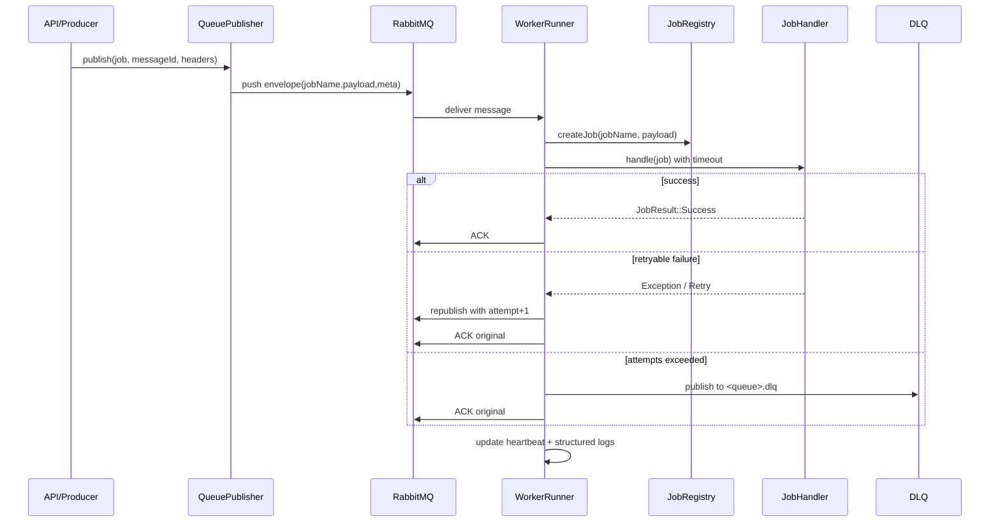

# Обновление очередей: надежность и мониторинг

Документ описывает изменения в `src/Core/Queue`, добавленные для повышения надежности обработки, наблюдаемости и упрощения описания `Job`.

## Что изменилось

1. Добавлен soft-timeout выполнения `Job` в воркере.
2. Добавлен retry-механизм с лимитом попыток и отправкой в DLQ.
3. Добавлена детальная видимость по экземплярам воркеров (`workerInstanceId`).
4. Внутренние логи воркера переведены на PSR-логгер с поддержкой Monolog.
5. Добавлен dual-mode для `Job`: легаси `serialize/deserialize` + новый payload-native режим.
6. Добавлен базовый класс `PayloadQueueJob` для удобного описания новых `Job`.

---

## Схема работы механизма

### Компонентная схема

```mermaid
flowchart LR
    A[Controller / Service] -->|publish(Job)| B[RabbitMQQueuePublisher]
    B --> C[(RabbitMQ Exchange)]
    C --> D[(Main Queue)]
    D --> E[RabbitMQWorkerRunner]
    E --> F[JobRegistry]
    F --> G[Job + Handler]
    G -->|JobResult::Success| H[ACK]
    G -->|Exception / Timeout / Retry| I[Retry publish attempt+1]
    I --> C
    E -->|attempt > maxRetries| J[(DLX Exchange)]
    J --> K[(DLQ Queue)]
    E --> L[WorkerHeartbeat]
    E --> M[Monolog/PSR Logger]
```

### Последовательность обработки одного сообщения



---

## 1) Надежность обработки

### Soft timeout для `handle()`

В `RabbitMQWorkerRunner` добавлена политика выполнения:

- `jobTimeoutSec` (по умолчанию `120`)
- `maxRetries` (по умолчанию `3`)
- `enableDlq` (по умолчанию `true`)

При превышении timeout задача считается ошибочной и попадает в retry/DLQ поток.

### Retry и DLQ

Дефолтная политика:

- попытки `0..2` -> перепубликация в исходный routing key с увеличенным `attempt`
- попытка `3` -> публикация в DLQ

DLQ топология:

- exchange: `<exchange>.dlx`
- queue: `<queue>.dlq`
- routing key: `<routing_key>.dlq`

Топология создается автоматически в `QueueClientAndPublisherFactory`.

---

## 2) Наблюдаемость нескольких воркеров

### Новый идентификатор процесса

Каждый запущенный процесс получает `workerInstanceId` в формате:

`<workerId>@<hostname>:<pid>:<startedAt>`

### Что теперь хранится в heartbeat

Для каждого экземпляра сохраняются:

- `status` (`running`, `processing`, `stopped`)
- `pid`, `hostname`, `consumer_tag`
- текущая задача (`current_job_name`)
- текущий `message_id` и `attempt`
- агрегированные счетчики (`processed`, `success`, `retried`, `failed`, `dlq`, `timeouts`)

### API мониторинга

Теперь в ответах:

- `/api/queue/dashboard` добавлены `instances` и `active_instances`
- `/api/worker-health` добавлен блок `instances`

Старые поля `alive`/`status` сохранены для обратной совместимости.

---

## 3) Новый способ описания Job (без лишней сериализации)

### Dual-mode поддержка

`JobRegistry` теперь поддерживает два режима:

1. Легаси режим:
   - `JobInterface::serialize()`
   - `JobInterface::deserialize()`
2. Payload-native режим:
   - `PayloadJobInterface::toPayload(): array`
   - `PayloadJobInterface::fromPayload(array $payload): static`

Если класс реализует `PayloadJobInterface`, используется payload-native путь без промежуточного JSON внутри `payload`.

### Базовый класс `PayloadQueueJob`

Для новых задач используйте `SpsFW\Core\Queue\PayloadQueueJob`.

Он:

- реализует `JobInterface` и `PayloadJobInterface`
- использует `AutoPayloadJobTrait`
- автоматически сериализует/десериализует payload

Пример:

```php
<?php

namespace App\Queue;

use SpsFW\Core\Queue\Attributes\QueueJob;
use SpsFW\Core\Queue\PayloadQueueJob;

#[QueueJob('send_notification')]
class SendNotificationJob extends PayloadQueueJob
{
    public function __construct(
        public readonly string $email,
        public readonly string $subject,
        public readonly string $message,
    ) {}

    public function getName(): string
    {
        return 'send_notification';
    }
}
```

### Совместимость с легаси

Существующие классы `Job`, которые уже реализуют `JobInterface` и имеют `serialize/deserialize`, продолжают работать без изменений.

---

## Как создать новый тип задачи

1. Создайте `Job` класс с `#[QueueJob('your-job-name')]`.
2. Для нового кода используйте `PayloadQueueJob` или `PayloadJobInterface` (payload-native путь).
3. Создайте `Handler` с `#[JobHandler('your-job-name')]` и верните `JobResult`.
4. Добавьте worker-конфиг (`queue`, `exchange`, `routing_key`) в `WorkerConfig`.
5. Отправляйте задачу через `QueueClientAndPublisherFactory::createByWorkerName(...)->publish(...)`.
6. Прокидывайте `message_id`/`x-correlation-id` в свойствах публикации для трассировки.
7. Проверьте в `/api/queue/dashboard`, что виден нужный `workerInstanceId`.

Минимальный каркас:

```php
use SpsFW\Core\Queue\PayloadQueueJob;

#[QueueJob('my-job', handlerClass: MyJobHandler::class)]
class MyJob extends PayloadQueueJob
{
    public function __construct(public readonly string $entityId) {}

    public function getName(): string
    {
        return 'my-job';
    }
}

#[JobHandler('my-job')]
class MyJobHandler implements JobHandlerInterface
{
    public function handle(JobInterface $job): JobResult
    {
        // бизнес-логика
        return JobResult::Success;
    }
}
```

---

## 4) Логирование и Monolog

### Внутри Queue runtime

`RabbitMQWorkerRunner` пишет структурированные события:

- `worker_started`, `worker_stopped`
- `job_started`, `job_completed`, `job_exception`
- `job_retry_scheduled`, `job_sent_to_dlq`
- `invalid_message_json`, `invalid_envelope`
- `chunk_buffered`, `chunk_processing_failed`

Контекст включает `worker_id`, `worker_instance_id`, `job_name`, `message_id`, `attempt`, `consumer_tag`, `pid`, `hostname`.

### Конфигурация логгера

Добавлен `SpsFW\Core\Psr\MonologLogger`.

- если `monolog/monolog` установлен, используется `Monolog\Logger` + JSON formatter
- если пакет еще не установлен, автоматически используется fallback на `FileLogger`

---

## 5) Практические рекомендации по миграции

1. Обновите зависимости (`composer install`) чтобы подтянуть `monolog/monolog`.
2. Проверьте параметры RabbitMQ:
   - если heartbeat включен: `heartbeat >= 30` и `read_write_timeout >= heartbeat * 2`
   - если heartbeat должен быть выключен: задайте `heartbeat = 0` (framework больше не форсит `30`)
3. Убедитесь, что для воркеров заданы корректные `queue`/`exchange`/`routing_key` в `WorkerConfig`.
4. Для новых задач используйте `PayloadQueueJob` либо `PayloadJobInterface`.
5. Для существующих задач миграция не обязательна.

---

## 6) Acceptance-checklist

1. При искусственной ошибке задача ретраится до 3 попыток.
2. После лимита попыток сообщение появляется в `<queue>.dlq`.
3. В `/api/queue/dashboard` видны отдельные экземпляры одного `workerId`.
4. В логах есть сквозная цепочка событий по `message_id`.
